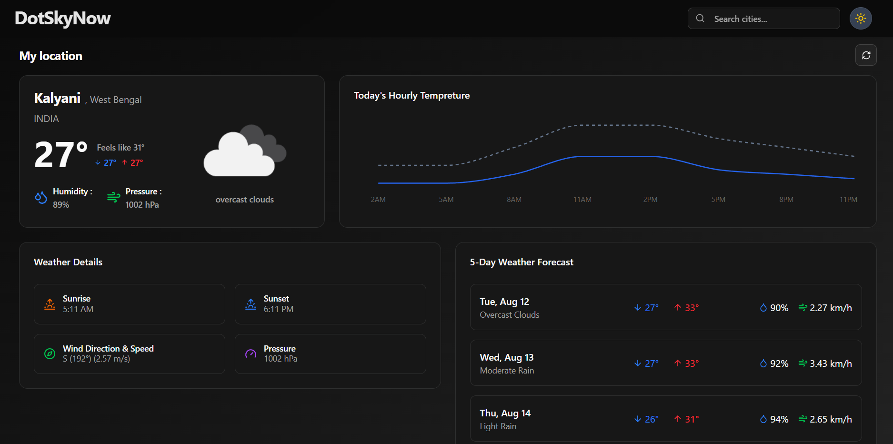
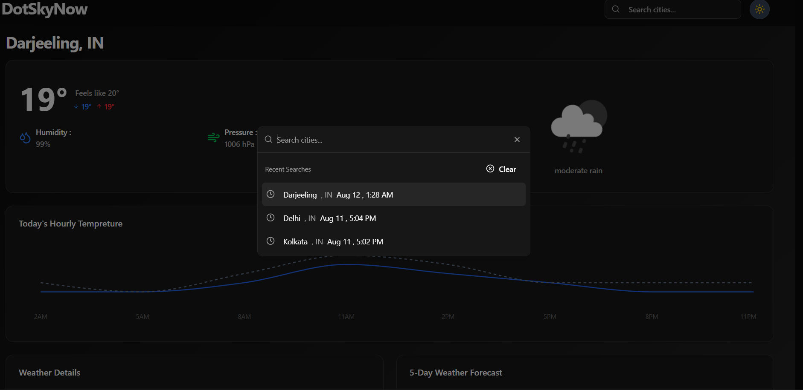
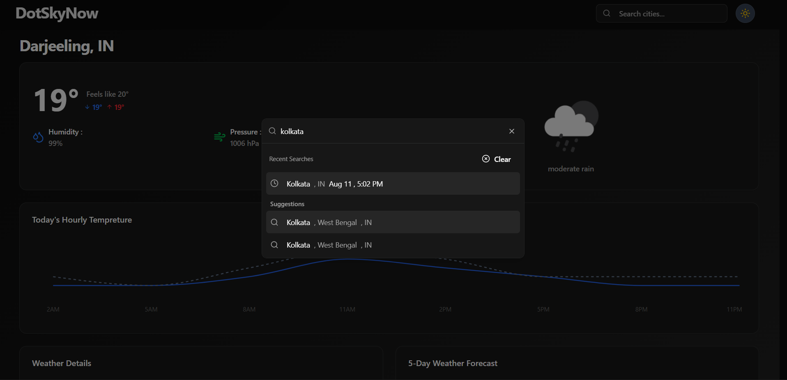

# 🌤️ DotSkyNow

DotSkyNow is a modern, responsive weather application built using **React**, **TypeScript**, and **shadcn/ui**.  
It provides real-time weather information, forecasts, and location-based weather updates using the **OpenWeatherMap API**.

🔗 **Live Demo:** [https://dotskynow.vercel.app/](https://dotskynow.vercel.app/)  
📦 **Repository:** [https://github.com/dotsatya/DotSkyNow](https://github.com/dotsatya/DotSkyNow)

---

## ✨ Features

- 🌍 **Real-time Weather Data** – Get current temperature, humidity, wind speed, and more.
- 📍 **Location Search** – Search weather by city name with autocomplete suggestions.
- 🗺️ **Geolocation Support** – Automatically detect and display weather for your current location.
- 📊 **Hourly & Daily Forecasts** – View temperature changes throughout the day/week.
- 📱 **Responsive UI** – Optimized for mobile, tablet, and desktop screens.
- ⚡ **Fast & Cached Data** – Uses **TanStack Query** for API caching and state management.
- 🎨 **Modern UI Components** – Styled with **shadcn/ui** and **Tailwind-based** design system.
- 🌗 **Theme Switching** – System-based light/dark theme.

---

## 🛠️ Tech Stack

**Frontend:**
- [React](https://react.dev/) – Component-based UI library
- [TypeScript](https://www.typescriptlang.org/) – Strongly typed JavaScript
- [shadcn/ui](https://ui.shadcn.com/) – Accessible and customizable UI components
- [React Router DOM](https://reactrouter.com/) – Client-side routing
- [TanStack Query](https://tanstack.com/query/latest) – Server state management
- [Lucide React](https://lucide.dev/) – Icon library

**API:**
- [OpenWeatherMap API](https://openweathermap.org/) – Weather data provider

**Development:**
- ESLint + TypeScript strict mode – Code linting & type safety
- Prettier – Code formatting

---

## 🔑 API Usage

DotSkyNow uses the **[OpenWeatherMap API](https://openweathermap.org/api)** to fetch:
- Current weather data
- Hourly forecasts
- Daily forecasts

**Example Request:**
```ts
const url = `${API_CONFIG.BASE_URL}/weather?q=London&appid=${API_CONFIG.API_KEY}`;

---

## Response Example:

{
  "coord": { "lon": -0.1257, "lat": 51.5085 },
  "weather": [{ "description": "clear sky", "icon": "01d" }],
  "main": { "temp": 18.32, "humidity": 56 },
  "wind": { "speed": 3.09 },
  "name": "London"
}

---

## 🖼️ Screenshots

### 🌤 Dashboard


### 📍 City Search



### 📊 Weather Forecast

